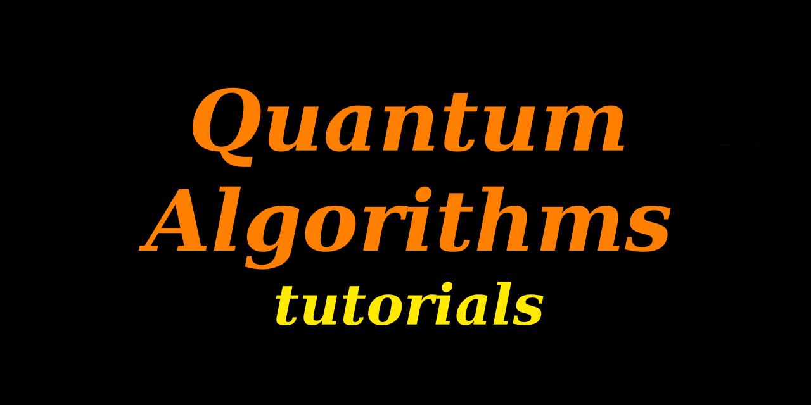

<h1 align="left">
	Tutorials for Quantum Algorithms
</h1>

This is a collection of tutorials for quantum algorithms. 
Here is the list of the tutorials (existing and planned).

* [Iterative phase estimation algorithm (IPEA)](https://github.com/DavitKhach/quantum-algorithms-tutorials/blob/master/iterative_phase_estimation.ipynb)

* [Variational quantum eigensolver (VQE)](https://github.com/DavitKhach/quantum-algorithms-tutorials/blob/master/variationa_quantum_eigensolver.ipynb)

* *Phase estimation algorithm (PEA)* (next)
* *HHL algorithm* (planed)
* *Simon's algorithm* (planed)
* *Shor's quantum factoring algorithm* (planed)
* ...

For working with the jupyter notebook tutorials the following packages are required:

* [qiskit](https://qiskit.org/documentation/):  an open-source framework for working with quantum computers.
* [jupyter notebook](https://jupyter.org/install): a tool for interactive computing.

&nbsp;

P.S. If you will find errors in the codes or in the text (grammar, math) please let me know.

(c) Davit Khachatryan

contacts [linkedin](https://www.linkedin.com/in/davit-khachatryan-b07383174/) [twitter](https://twitter.com/davit_khach)  [facebook](https://www.facebook.com/davit.khachatryan.773)

email: davit.n.khachatryan@gmail.com

